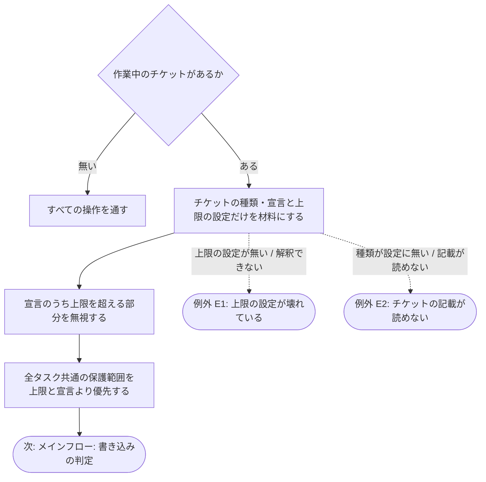
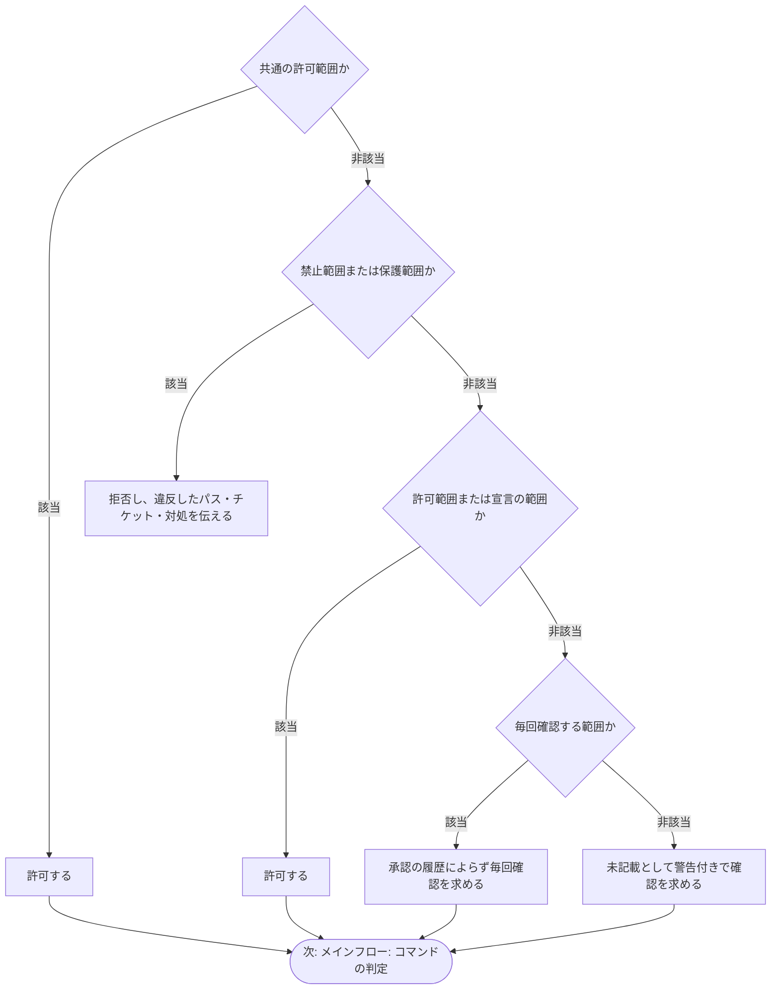
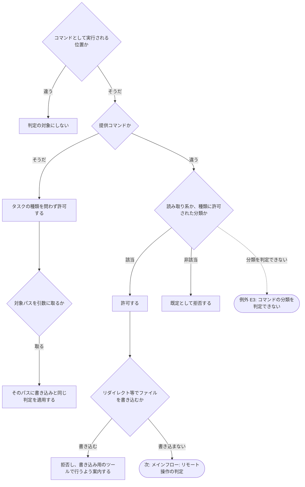
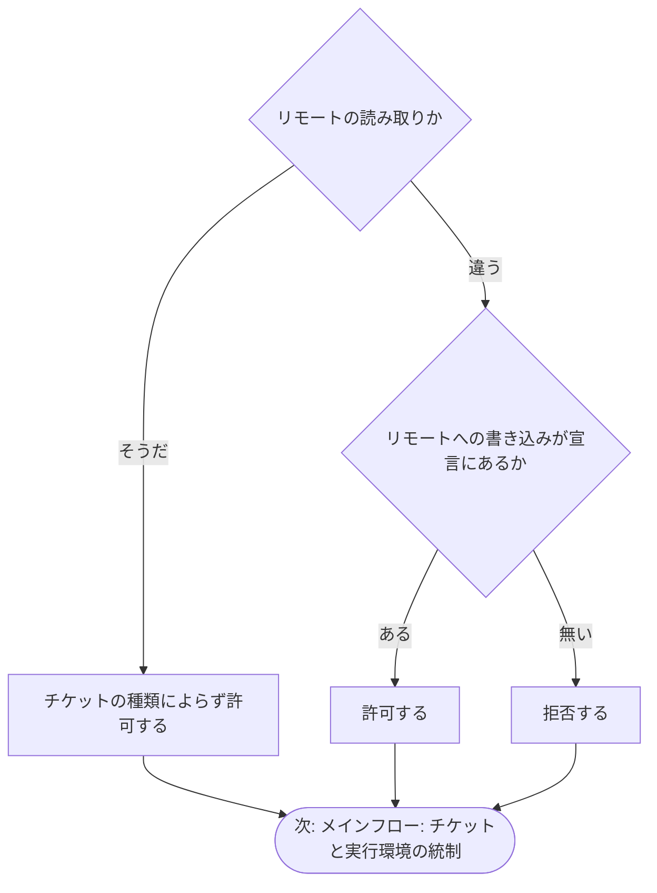
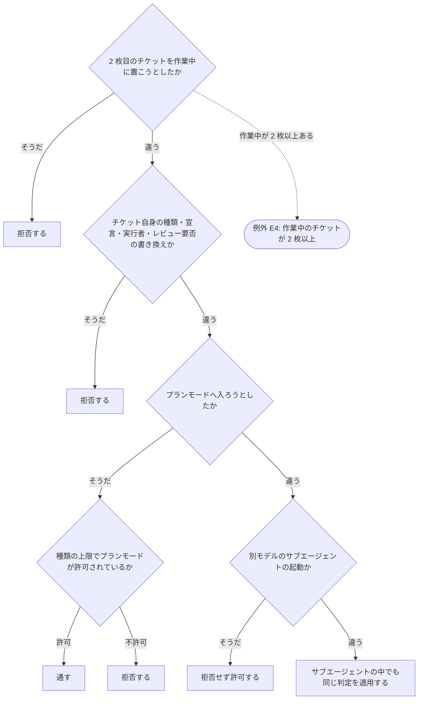

# workflow-guard フック

## 概要

チケットの作業中に、AI の書き込みと操作を、そのチケットに宣言された「やってよいこと」（書き込んでよい範囲・実行してよい操作の分類）の範囲でだけ許可するフックの要件を定義する。宣言の上限はタスクの種類ごとにユーザーが管理する設定が決め、チケットの宣言でそれを超えて権限を広げることはできない。範囲外の操作は拒否され、AI には「何に違反したか・どのチケットの作業中か・次に取るべき対処」が伝えられる。本書は GitLab の用語で書き、GitHub では MR → PR、`glab` → `gh` と読み替える。

- **背景**: 調査のつもりでコードを書き換える、設計チケットの中で `.claude/` 配下を直す、といった逸脱は指示だけでは防げない。チケットに宣言を書かせてレビュアーが範囲を読めるようにしつつ、宣言は AI 自身が書くため、そのまま信頼すると自分で権限を広げられる。「設定はユーザーが管理する（信頼する）、チケットは AI が書く（信頼しない）」という境界を機械的に守る仕組みが要る。
- **目的**: 作業中のチケットの宣言とタスクの種類の上限だけを材料に、書き込み・操作を許可 / 確認 / 拒否のいずれかに判定し、逸脱を拒否して対処を伝え、判定の記録を振り返りに使える状態を実現する。
- **スコープ**:
  - 含む: 判定の材料（作業中のチケットの宣言・タスクの種類の上限）、書き込みの判定（許可 / 禁止 / 毎回確認 / 未記載）、操作（コマンド）の判定、同時に作業中のチケットの上限、チケット自身の改変の拒否、プランモード・リモート操作・サブエージェント起動の統制、判定の記録、設定不正時の安全側への倒し方
  - 含まない: 振り分けの宣言の強制（`workflow-entry`）、操作のあとの差分検知と承認の記憶の記録（`workflow-diff-check`）、進行状態のファイルと作業中チケットの置き場の保護・draft 解除の拒否（`workflow-state-guard`）、`git` のコミット・push の直接実行の拒否（`block-direct-git`）、チケットの着手・完了そのもの（提供コマンドと各 work スキル）

---

## ユーザーストーリー

**[As a]** Claude Code に作業を任せる開発者として、

**[I want]** AI がチケットに宣言した範囲の外へ書き込んだり、そのチケットで許されていない操作をしたりしたら、機械的に止めてほしい。

**[So that]** 調査中の意図しない変更や、AI 自身による権限の拡大を防ぎ、チケットを読めば「何が触られうるか」が分かる状態を保てるため。

**[As a]** レビュアーとして、

**[I want]** 各チケットの宣言が、ユーザーが管理する上限の内側に収まっていることを機構が保証していてほしい。

**[So that]** チケットの宣言を読むだけで、その作業の影響範囲を信頼して確認できるため。

---

## 受け入れ基準（Acceptance Criteria）

### メインフロー: 判定の材料の確定

- When 作業中のチケットが無いとき、Shall not フックは何も判定せず、すべての操作を通さなければならない（通常セッションへの影響ゼロ。振り分けの統制は `workflow-entry` が担う）。
- When 作業中のチケットがあるとき、Shall フックはそのチケットに書かれたタスクの種類と宣言（書き込んでよい範囲・実行してよい操作の分類）、およびタスクの種類ごとの上限を定めるユーザー管理の設定だけを判定の材料とし、AI の説明や会話の内容を材料にしてはならない。
- When チケットの宣言が上限を超える範囲を含むとき、Shall フックは超える部分を無視し、禁止範囲と毎回確認の範囲を宣言で覆せてはならない（宣言は上限の内側で範囲を明示するためのもの）。
- When 全タスク共通の保護範囲（`.claude/` 配下など）が設定に定められているとき、Shall フックはそれをタスクの種類の上限とチケットの宣言のどちらより優先しなければならない。ただし設定でそのタスクの種類に明示的に許可された範囲（AI アセット設計は `.claude/docs/`、AI アセット実装・テストはフック・スキル・ルール・エージェント・設定）は許可する。

### メインフロー: 書き込みの判定

- When 作業領域のチケットの置き場（未着手・完了）や一時ファイルの置き場（`wip/tmp/`）など、すべてのタスクに共通して必要な範囲が設定で共通の許可範囲として定められているとき、Shall フックはタスクの種類を問わず許可しなければならない。
- When AI がファイルを書き込もうとし、そのパスがタスクの種類の禁止範囲または全タスク共通の保護範囲にあるとき、Shall フックは拒否し、違反したパス・作業中のチケットとタスクの種類・対処（宣言の範囲内で進める。範囲を広げる必要があるなら迂回せずユーザーに提案する）を AI に伝えなければならない。
- When パスがタスクの種類の許可範囲またはチケットの宣言の範囲にあるとき、Shall フックは許可しなければならない。
- When パスが毎回確認する範囲にあるとき、Shall フックは承認の履歴にかかわらず毎回ユーザーに確認を求めなければならない。
- When パスが設定にも宣言にも無いとき、Shall フックは拒否ではなく、「本来想定していないパスに書き込もうとしている」旨の警告と作業中のチケットを添えてユーザーに確認を求めなければならない。

### メインフロー: コマンドの判定

- When コマンドを判定するとき、Shall フックはコマンドとして実際に実行される位置にある場合だけを対象にし、ヒアドキュメント・クォート・コメント・日本語の地の文に語が現れるだけで拒否・分類してはならない（コマンド位置の判定は `block-direct-git` と共有する）。
- When 提供コマンドが実行されるとき、Shall フックはタスクの種類を問わず許可しなければならない（前提条件の検証は提供コマンド自身が行う）。
- When コマンドが対象パスを取るチケット運用や提供コマンド（コミット対象の指定など）であるとき、Shall フックはそのパスに書き込みと同じ判定を適用しなければならない。
- When AI がコマンドを実行しようとしたとき、Shall フックは既定で拒否し、次だけを許可しなければならない: 状態を変えない読み取り系のコマンド、作業中のチケットのタスクの種類に設定で許可された分類の操作（ビルド・テストの実行、フックのテストの実行など）、機構の提供コマンド。
- When コマンドがリダイレクト・コピー・移動などでファイルを作成・更新するとき、Shall フックはそれを既定で拒否し、ファイルの書き込みは書き込み用のツール（Edit / Write）で行うよう案内しなければならない。
- When コマンドが**削除だけ**を行うとき、Shall フックは対象が作業中のチケットの宣言した範囲に収まっている場合に限って許可しなければならない（書き込み用のツールにファイルを消す手段が無く、許さなければ AI は自分が作ったアセットを片付けられない）。Shall not 対象がディレクトリで配下に保護範囲・毎回確認の範囲・進行状態のファイルを含み得る場合、対象が展開前の文字列（glob・ブレース・変数）を含む場合、対象を読み取れない場合は許可してはならない（いずれも消える範囲が判定時に決まらない）。

### メインフロー: リモート操作の判定

- When リモートの読み取り（issue / MR の参照・レビューの取得・状態の確認）が試みられたとき、Shall フックはチケットのタスクの種類によらず許可しなければならない。
- When リモートへの書き込み（push・issue の起票・追記・コメント・MR の作成・編集）が試みられたとき、Shall フックは作業中のチケットの宣言（実行してよい操作の分類。タスクの種類の上限内）にその操作があるときだけ許可し、無ければ拒否しなければならない（既定でリモート書き込みを宣言するのは全体計画・フィードバック計画・全体まとめのチケット。draft 解除の直接実行は `workflow-state-guard` が常に拒否する）。

### メインフロー: チケットと実行環境の統制

- When 作業中のチケットが既に 1 枚あり、2 枚目のチケットを作業中に置こうとしたとき、Shall フックは拒否しなければならない（同時に作業中のチケットは 1 枚）。
- When AI が作業中のチケット自身のタスクの種類・宣言・実行者・人間レビューの要否を書き換えようとしたとき、Shall フックは拒否しなければならない（例外フローの復旧経路として行う修正を除く）。作業ログ・DoD のチェックなど、それ以外の欄の編集は許可する。
- When チケットの作業中に AI がプランモードへ入ろうとしたとき、Shall フックはタスクの種類の上限でプランモードが許可されたチケット（既定では全体計画のみ）を除いて拒否しなければならない（プランモードは全体計画の合意にだけ使う）。
- When 作業中のチケットに実行者（LLM モデル）が書かれた状態で、AI が別のモデルのサブエージェントを起動しようとしたとき、Shall フックは拒否せず許可しなければならない（実行者との不一致は `subagent-start-check` が起動の時点で AI に伝える）。
- When サブエージェントの中で操作が行われるとき、Shall フックはメインエージェントと同じ判定を適用しなければならない（チケット単位のサブエージェントにも宣言の強制が同じように働く）。

### 代替フロー

- **[A1]** If 緊急停止が必要になった場合、Then AI は同じセッションの中で停止を設定できない（停止は環境変数の設定だけで行え、セッションの開始時にしか反映されない）ため、ユーザーに設定してほしい内容（機構全体の停止か、このフックだけの停止か）を伝え、新しいセッションでの実行を促さなければならない。停止が設定されたセッションでは、フックは判定を行わず、停止していることが記録から分かるようにしなければならない。
- **[A2]** If ユーザーが応答できない実行形態（`claude -p`、CI）で確認が必要になった場合、Then その確認は拒否として扱われ、拒否の案内には「計画タスクで宣言を十分に列挙する必要がある」ことが含まれていなければならない。

### 例外フロー

- **[E1]** If タスクの種類ごとの上限を定める設定が存在しない、または解釈できない場合、Then フックは安全側に倒して書き込みと実行を拒否し、復旧経路として提供コマンドの実行と、その設定ファイル自身・作業領域のチケットの修正だけを許可しなければならない。
- **[E2]** If 作業中のチケットのタスクの種類が設定に無い、またはチケットの先頭の記載が読み取れない場合、Then フックは安全側に倒して書き込みと実行を拒否し、復旧経路として提供コマンドの実行とそのチケット自身の記載の修正だけを許可し、理由と対処（チケットを提供コマンドで未着手へ戻す、または記載を直す）を伝えなければならない。
- **[E3]** If コマンドの分類を判定できない場合（文字列をコードとして受け取る実行系・判定の依存が満たせない等）、Then フックは拒否側に倒し、判定できなかったことをメッセージに含めなければならない。
- **[E4]** If 作業中のチケットが 2 枚以上ある異常な状態の場合、Then フックは提供コマンド以外の書き込みと実行を拒否し、1 枚だけを残して他を提供コマンドで未着手または完了へ戻す対処を伝えなければならない。Shall not 提供コマンドはこの状態を検知する責任を負わない（1 枚である前提で動く）。
- **[E5]** If フックが操作を拒否した場合、Then フックは作業ツリーへの自動的な巻き戻し（`git checkout --` 等の破壊的操作）を行ってはならない。復旧は伝えられた対処に従って AI が行う。
- **[E6]** If AI がこのフックに拒否された場合、Then AI は進行状態の直接編集・別の手段での迂回・機構の緊急停止を行わず、伝えられた対処に従うかユーザーに提案しなければならない。

### 規約: 上限の設定

- When タスクの種類ごとの上限（許可範囲・禁止範囲・毎回確認する範囲・実行してよい操作の分類）を定義・変更するとき、Shall それはフックのコードではなくユーザーが管理する設定で行え、フックはそれを読み込んで適用しなければならない。
- When 設定を用意するとき、Shall 設定は 15 種のタスクすべてに上限を持たなければならない。

### 規約: 判定の記録と承認の記憶

- When フックが許可・確認・拒否のいずれかを判定したとき、Shall その記録（操作の種類・対象・作業中のチケット・判定と根拠）が残り、フィードバック計画の振り返りで AI とユーザーが参照できなければならない。記録に機密情報を含めない。
- When 未記載のパスへの書き込みがユーザーに承認されたとき、Shall その承認は同じセッション内でだけ有効で、セッションをまたいで引き継がれてはならない。承認された範囲（既定は親ディレクトリ単位。設定で指定した特別なファイルはファイル単位）は同じセッション内では再確認しない。

### 規約: 拒否と確認のメッセージ

- When 拒否メッセージを出すとき、Shall メッセージは違反の種類ごとに機械的に区別できる識別子を持ち、「何に違反したか」「どのチケットの作業中か」「次に取るべき対処」を含んでいなければならない。対処には「迂回せず、必要ならユーザーに提案する」ことを含める。
- When 確認を求めるとき、Shall 確認の理由（未記載のパスか、毎回確認の範囲か）と作業中のチケットが確認の文面に含まれていなければならない。
---

## 前提条件

- チケットがタスクの種類・状態・先行チケット・実行者・人間レビューの要否・やってよいこと（書き込んでよい範囲・実行してよい操作の分類）・目的・DoD を、機構が解釈できる形で持っていること（チケットテンプレート）
- タスクの種類ごとの上限を定める設定がユーザーの管理下にあり、15 種のタスクすべてに対応していること
- チケットの着手・完了が提供コマンドで行われ、作業中のチケットの置き場が作業中かどうかの唯一の判定の元になっていること
- 作業は default ブランチ以外の feature ブランチ上で行われること

---

## 制約条件

- **技術的制約**: 実体は bash で書き、Windows の git bash で動く。ステートレスであり、判定に必要な情報はすべてファイル（作業中のチケット・設定・セッション内の記憶）から取得する。Claude Code の権限設定だけでは複合コマンドを止められないため、強制はこのフックが担い、権限設定は多重防御として併用してよい。判定の記録とセッションに紐づく状態はコミットの対象にせず、同じ作業ツリーで並行する別のセッションと分離する。記録・状態の置き場と寿命、拒否メッセージの識別子と緊急停止の環境変数の体系は、フック横断の仕様書が正として定める
- **ビジネス的制約**: 上限の設定を変えるのはユーザー。AI はチケットの宣言で上限の内側を明示するだけで、上限を広げる変更は AI アセット実装・テストのチケットの中でレビューを経て行う
- **外部的制約**: 悪意ある迂回への対抗は目的としない（既定動作を安全側へ倒す仕組みであり、安全境界ではない）

---

## 依存関係

- タスクの種類ごとの上限を定める設定（未作成。内容と形式は仕様書が定める）
- チケットテンプレート（宣言の記載欄。未作成）
- `workflow-diff-check`（未記載パスの承認をセッション内の記憶として記録し、操作のあとの差分を検知する。未作成）
- `workflow-state-guard`（進行状態のファイルと作業中チケットの置き場の保護。未作成）
- `workflow-entry`（作業中のチケットが無い間の振り分けの統制。未作成）
- チケットの着手・完了・レビュー依頼と完了・マージ前作業・コミット・push の提供コマンド（許可対象。未作成）
- `.claude/rules/`（ユーザーが応答できない実行形態の考慮、bash 規約）

---

## 非機能要件

| 項目 | 説明 |
|------|------|
| パフォーマンス | 作業中のチケットが無いときは即座に通し、あるときも対象外の操作の判定は体感できない時間（数十 ms）で終わる |
| セキュリティ | AI が書いた宣言を信頼せず、権限の上限はユーザー管理の設定が決める。記録・拒否メッセージ・確認の文面に機密情報を含めない |
| 可用性 | 設定やチケットの記載が壊れたときは拒否側に倒し、復旧経路（設定ファイルとチケットの修正）だけを残す |
| 保守性 | タスクの種類の追加は設定への 1 エントリの追加で済み、フックのコードを変えない。拒否メッセージの識別子は機械的に分類できる |
| ヘッドレス耐性 | 確認が拒否として扱われても、AI が対処（宣言の見直しの提案）へ進める案内を出す |
| テスト容易性 | 作業領域の状態・設定・操作を与えて、許可 / 確認 / 拒否とメッセージを単体テストできる。テストには複合コマンド・ヒアドキュメント・リダイレクト・読み取り系の代表例を含める。テストは合否件数を出力し失敗時に非 0 で終わる |
