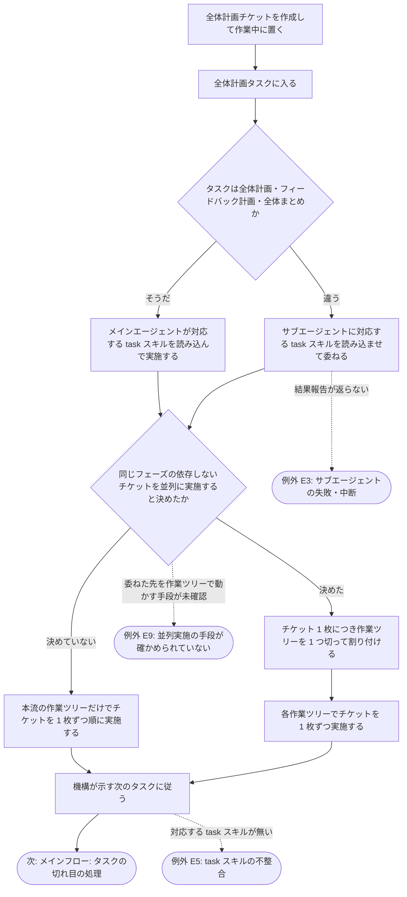
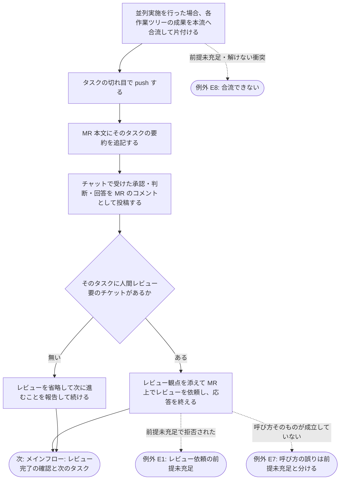
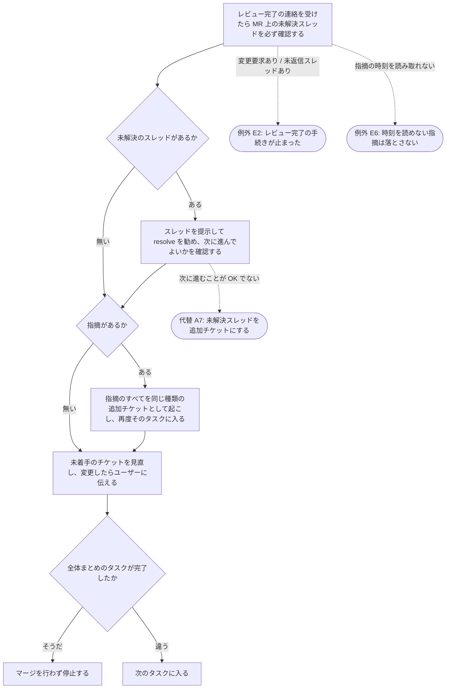

# 00-workflow-issue-mr-driven スキル

## 概要

開発作業向けの振り分けスキルの要件を定義する。このスキルはタスクの起動順序と切れ目の処理だけを司るオーケストレータで、各タスクの中身と承認は task スキルに、issue・ブランチ・MR の操作は common-step スキルに委ねる。本書は GitLab の用語で書き、GitHub では MR → PR、`glab` → `gh` と読み替える。

- **背景**: チケット駆動の実作業だけでは「その作業がどの issue に対するもので、どの MR に載るのか」「どこで人間が確認するのか」が決まらない。作業の起点を issue に固定し、タスクの切れ目で人間の判断を挟む順序を 1 か所で司りたい。
- **目的**: 「全体計画チケットの着手 → 全体計画タスク → タスクの繰り返し（切れ目ごとに必要なら人間レビュー）→ 全体まとめ → 停止」の順序を固定し、すべての作業が 1 issue = 1 ブランチ = 1 MR に紐づき、レビューが必要な箇所を飛ばして進めない状態を実現する。
- **スコープ**:
  - 含む: スキル本体（SKILL.md と参照資料）、タスクの構成（種類・順序・担当・切れ目の規則）、全体計画チケットの配置、タスクの起動と次のタスクの選択、**作業ツリーを切るかどうかの判断とチケットの割り付け（並列実施の起動）**、切れ目の処理（**作業ツリーの成果の合流**・push・MR 本文更新・レビュー依頼と完了・指摘への追加チケット・未着手チケットの見直し）、再開
  - 含まない: issue の確定・ブランチと draft MR の作成・フェーズ列の合意（`10-task-overall-plan`）、各タスクの内容と承認（`10-task-*`）、issue / ブランチ / MR の操作手順・**作業ツリーを切る / 一覧する / 合流する / 片付ける操作そのもの**（common-step スキル。作業ツリーは `20-common-step-worktree`）、宣言範囲の強制やタスク境界の判定の仕組み（仕様書）、MR のマージ（人間が行う）

### issue の受け入れ条件との対応

起点: issue #50（worktree 上での機構の健全性と、1 issue 内の同一フェーズのチケット並列実施）

| issue #50 の受け入れ条件 | 満たす受け入れ基準 |
|---|---|
| A1: worktree 上で機構（フック・提供コマンド・`boundary.sh`）が健全に動くことが実測で確かめられ、動かない箇所があれば直っている | この書の対象外（`workflow-guard` / `workflow-state-guard` / `workflow-diff-check` / `session-start` の要件と仕様、`10_spec/フック共通仕様.md` が担う） |
| A2: issue-MR 駆動を開始するときに worktree を切るかどうかの既定と手順が要件・仕様に定まっている | メインフロー「作業ツリーを切らずに本流のチェックアウトだけで進めなければならない（既定）」／「並列にするチケットを選び、1 枚につき 1 つの作業ツリーを切って割り付ける」／切れ目の「各作業ツリーの成果を本流へ合流し、片付ける」／代替フロー **[A10]**（ヘッドレスでも既定のまま進む） |
| A3: 並行作業の手段（worktree / 別 clone）が CLAUDE.md か振り分けスキルから 1 ホップで辿れる | 整合「作業ツリーを切る・一覧する・合流する・片付けるとき…`20-common-step-worktree` に委ねなければならない」（振り分けスキルからこの 1 参照で手段に届く。`CLAUDE.md` は変更しない） |
| A4: 1 issue の中で同じフェーズの依存しないチケットを並列に実施する方式について、採否と理由が新しい DDR に残っている | 方式の本体はメインフロー（並列実施の起動）と切れ目の合流。採否と理由は DDR `i0050-01`、開始時の既定は DDR `i0050-06`、**発効を手段の確認まで保留すること**は DDR `i0050-08` が担う |
| A5: 並列を採用する場合、宣言範囲の強制・差分の基準点・実行者照合が worktree ごとに一意に決まることが仕様に明記され、機械テストで確認されている | この書の対象外（`workflow-guard` / `workflow-diff-check` / `subagent-start-check` / `subagent-stop-check` の仕様が担う）。この書は 1 作業ツリーにつき作業中のチケットを 1 枚に保つ側と、一意に決まらない起動（委ねた先が割り付けた作業ツリーで動かない起動）を行わない側（例外フロー **[E9]**）に立つ |
| A6: 並列を採用する場合、並列作業の成果を feature ブランチへ合流させる手順（チケットファイルの衝突の扱いを含む）が定まっている | メインフロー「タスクの切れ目に達したとき…敵対的レビューと push のどちらよりも前に各作業ツリーの成果を本流へ合流し、片付けなければならない」／「切れ目とタスクの範囲は合流の後に確定する」／例外フロー **[E8]**。合流の操作と衝突の扱いそのものは `20-common-step-worktree` が担う。手順は定めるが、発効は例外フロー **[E9]** の条件が満たされてからである |

---

## ユーザーストーリー

**[As a]** Claude Code で開発する開発者として、

**[I want]** 依頼した作業を issue と MR に紐づけて、レビューが必要なタスクの切れ目で MR 上のレビューを挟みながら進めたい。

**[So that]** AI の作業を必要な箇所で確認でき、依頼・合意・作業・成果の経緯を GitLab / GitHub 上で追えるため。

---

## 受け入れ基準（Acceptance Criteria）

### メインフロー: 着手とタスクの実行

- When このスキルで進めると決まったとき、Shall スキルは最初に全体計画チケットを作成して作業中に置き（以降のプロンプトで振り分けの再宣言を求められない状態にする）、全体計画タスクに入らなければならない。issue・ブランチ・MR の作成と push は、全体計画チケットの「やってよいこと」に宣言された操作として行える。
- When タスクに入るとき、Shall スキルはそのタスクが全体計画・フィードバック計画・全体まとめのいずれかならメインエージェント自身で対応する task スキルを読み込んで実施し、それ以外ならサブエージェント（全体計画で合意したモデル）に対応する task スキルを読み込ませて委ね、自身はタスクの起動・結果報告の受け取り・切れ目の処理に徹しなければならない。
- When タスクの中のチケットを実施するとき、Shall チケットは 1 つの作業ツリーにつき 1 枚ずつ順に実施し、新しいコンテキストで実施したいとき（チケットの実行者がタスクのモデルと異なるときを含む）に限り、チケット単位のサブエージェントに分割しなければならない。サブエージェントは入れ子にできないため、その起動はタスクからの要求を受けてこのスキルが行う。分割したチケットにも宣言した範囲の強制が同じように働く。
- When 開発作業を開始するとき、Shall スキルは作業ツリーを切らずに本流のチェックアウトだけで進めなければならない（既定。DDR i0050-06）。作業ツリーを切るのは、同じフェーズの依存しないチケットを並列に実施すると決めたときと、ユーザーが明示に指示したときに限る。
- When 並列実施を行うと決めたとき、Shall スキルは並列にするチケットを「同じ種類で、互いに先行していない未着手チケット」から選び、**1 枚につき 1 つの作業ツリーを切って割り付け**、同じチケットを 2 つの作業ツリーに割り付けてはならない。並列にしてよいタスクの種類は[タスク別の既定判断基準](../rules/work-defaults.md)に従い、計画タスクは並列にしてはならない。
- When 並列実施のためにチケットをサブエージェントへ委ねるとき、Shall スキルは起動時にそのチケットを実施する作業ツリーのありかを伝え、サブエージェントがその作業ツリーの中だけで作業する前提（チケットを新規に作らない・push しない・合流しない）を伝えなければならない。ありかを伝えるだけでは委ねた先の作業の場所は移らないため、スキルは委ねた先をその作業ツリーで動かす手段を持っていなければならない（DDR i0050-08）。
- When 計画タスクが完了するとき、Shall その計画タスクは同じフェーズの実施チケット群と、次のフェーズの計画チケット 1 枚を作成済みでなければならない（チケットを最初に全件作らない）。
- When 次に入るタスクを選ぶとき、Shall スキルは目視で判断せず機構の示す結果に従わなければならない。

### メインフロー: タスクの切れ目の処理

- When 1 つのタスク（同じ種類のチケット群）が完了したとき、Shall そこをタスクの切れ目とし、そのタスクのチケットに 1 枚でも「人間レビュー要」のものがあれば、その切れ目を「人間レビュー要の切れ目」として扱わなければならない。タスクの範囲は**チケットの種類のまとまり**で決まり、番号が連続しているかによらない（並列実施では完了の順序と番号の順序が一致しないため、どのタスクの切れ目にも含まれないチケットを作ってはならない）。
- When **並列実施を行った場合**にタスクの切れ目に達したとき、Shall スキルは**敵対的レビューと push のどちらよりも前に**、各作業ツリーの成果を本流へ合流し、合流できた作業ツリーを片付けてから切れ目の処理を続けなければならない（合流と片付けの操作は `20-common-step-worktree` に委ねる）。合流できないときは切れ目の処理を進めてはならない。
- When **並列実施を行った場合**にタスクの切れ目を確定するとき、Shall スキルは合流の後に切れ目とタスクの範囲を確定しなければならない。合流の前は、どの作業ツリーの作業中チケットも 0 枚になった状態を「切れ目の候補」として扱うにとどめ、完了したチケットの範囲・レビュー要否・レビュー依頼の対象をそこで決めてはならない（本流には作業ツリーで完了したチケットがまだ無いため）。
- When タスクの切れ目に達したとき、Shall スキルは push し、MR 本文にそのタスクの要約を追記しなければならない。
- When タスクの切れ目に達したとき、Shall スキルはそのタスクの間にチャットで受けた承認・判断・保留点への回答を MR のコメントとして投稿しなければならない（作業領域と全体計画書の記録は片付けと squash merge で消えるため、代わりにならない）。
- When MR 本文・MR コメント・issue に記録を書くとき、Shall not スキルは作業領域（`wip/`）配下のパスを恒久的な参照として書いてはならない（片付けと squash merge で参照先が消える。恒久的な参照は issue 番号・MR・正史のファイルに限る。レビュー依頼でレビュー対象を指す一時的な参照は例外）。
- When 人間レビュー要の切れ目に達したとき、Shall スキルはレビュー観点（差分範囲・見てほしい点・次のタスク）を添えて MR 上でレビューを依頼し、応答を終えて人間のレビューを待たなければならない（チャット上の質問でセッションを塞がない）。レビューが完了するまで次のタスクに進めてはならない。
- When 人間レビュー不要の切れ目に達したとき、Shall スキルは承認を求めず、人間レビューを省略して次のタスクに進むことを報告した上で続けなければならない。

### メインフロー: レビュー完了の確認と次のタスク

- When レビュー完了の連絡を受けたとき、Shall スキルはユーザーの言葉（「指摘なし」を含む）だけで判断せず、必ず MR 上に未解決（unresolved）のスレッドが無いかを確認し、レビュー結果と指摘を取得して提示しなければならない。
- When 未解決のスレッドが残っているとき（ユーザーが「指摘なし」と伝えた場合を含む）、Shall スキルはそのスレッドを提示して MR 上で resolve することを勧め、改めて次のタスクに進んでよいかをユーザーに確認しなければならない。
- When 未解決のスレッドが無く指摘も 0 件のとき、Shall スキルは次のタスクに進まなければならない。
- When 指摘があるとき、Shall スキルは指摘のすべてを同じ種類の追加チケットとして起こしてから再度そのタスクに入らなければならない（完了済みチケットを未完了に戻さない）。追加チケットのタスクの完了も切れ目として同じ処理を行う。
- When 次のタスクに進むとき、Shall スキルは未着手のチケット（範囲・実行者・レビュー要否・DoD）をレビュー結果や新しい知見に合わせて見直してよく、変更した場合はその内容をユーザーに伝えなければならない。
- When 全体まとめのタスクが完了したとき、Shall スキルはマージを行わず停止しなければならない。

### 代替フロー

- **[A1]** If 現在のブランチに open な MR があり、作業領域にチケット（未着手 / 作業中 / 完了）がある場合、Then スキルは全体計画タスクをやり直さず、現在地（タスクの途中 / レビュー依頼前 / レビュー待ち / レビュー済み）を機構から得て再開しなければならない。レビュー待ちのときはレビュー完了の連絡がない限り応答を終える。
- **[A2]** If 作業の開始・再開の時点で default ブランチに取り込んでいないコミットがある場合、Then スキルはその旨をユーザーに知らせ、取り込み（merge）を提案しなければならない（衝突が無くても、ベース側に追記されたルール・仕様を知らないまま作業を進めない）。
- **[A3]** If 全体計画タスクが「対応なし」で終わった場合（既存の closed な issue の結論を採る等）、Then スキルは全体計画チケットを取り消して停止しなければならない。
- **[A4]** If 全体計画タスクが issue の起票だけで終わった場合（着手の指示が無い）、Then スキルは全体計画チケットを取り消し、着手の指示を待たなければならない。
- **[A5]** If 小さな依頼でレビューの往復が過剰な場合、Then スキルはチケットの人間レビュー要否を「不要」に倒し、やることの無いフェーズは計画タスクで即座に完了することで対処し、必須フェーズの省略やタスクの種類の統合で対処してはならない。
- **[A6]** If `glab` / `gh` CLI が使えない環境の場合、Then スキルは機構の外部委任モード（MCP ツールでリモート操作を代行）を使い、WebFetch / curl へ落としてはならない。
- **[A7]** If 未解決のスレッドを残したまま次のタスクに進むことがユーザーに承認されなかった場合、Then スキルはそのスレッドを追加チケットとして起こさなければならない。
- **[A8]** If レビュアーがチャットでレビュー判断を伝えた場合、Then スキルはその判断を MR の通常コメントとして記録してからレビュー完了の手続きに進まなければならない。
- **[A9]** If MR を持たないまま作業を進める形態（単独実行モード）の場合、Then スキルは切れ目の処理をチャット上の報告で代え、その証跡が MR 上の記録より弱いことを結果に明記しなければならない。
- **[A10]** If ユーザーが応答できない実行形態（ヘッドレス）の場合、Then スキルは作業ツリーを切るかどうかを確認せず、既定（切らない・並列にしない）のまま進めなければならない。切ると決まっている場合の合流はタスクの切れ目で承認を求めずに行い、自動で解けない衝突が出たときだけ例外フロー **[E8]** で止まる。
- **[A11]** If 並列実施の途中で 1 つの作業ツリーのチケットだけが先に完了した場合、Then スキルは切れ目の処理に進まず、同じタスクの他の作業ツリーのチケットが完了するまで待たなければならない（タスクの切れ目の候補は、そのタスクのすべてのチケットが完了し、どの作業ツリーにも作業中のチケットが無い時点である）。
- **[A12]** If 並列実施の区間にある場合、Then スキルは機構が示す「次に実施するチケット」を新たな着手の指示として使ってはならない（割り付けは並列実施の起動時に確定しており、本流の側には作業ツリーで着手・完了したチケットがまだ現れないため、同じチケットが二重に着手される）。区間の間に着手するチケットは、起動時に割り付けたものだけである。

### 例外フロー

- **[E1]** If レビュー依頼が前提未充足（未コミット / 未 push / MR なし / タスクの切れ目でない / 既に依頼済み）で拒否された場合、Then スキルは未充足を解消して再実行し、切れ目でなければ次のチケットに着手しなければならない。
- **[E2]** If レビュー完了の手続きが「変更要求あり」または「未返信のスレッドあり」で止まった場合、Then スキルは同じ種類の追加チケットで対応し、スレッドに返信してから再実行しなければならない。進行状態を直して通そうとしない。
- **[E3]** If サブエージェントに委ねたタスクが失敗・中断して結果報告が返らない場合、Then スキルはチケットの状態を機構から確認し、作業中のまま残ったチケットを報告してユーザーの指示を待たなければならない（勝手に完了にしない）。
- **[E4]** If タスクの中の承認で却下された場合、Then スキルはその段階に留まり、先のタスクへ進んではならない。
- **[E5]** If 機構が示した次のタスクに対応する task スキルが無い場合、Then スキルは不整合として報告して停止しなければならない。
- **[E6]** If 指摘がレビュー依頼より後のものかを時刻から判定できない場合、Then 機構はその指摘を除外せず、取得した指摘に含めなければならない（取りこぼすと人間のレビューが無かったことになるのに対し、余分な 1 件は人間が読んで捨てられる）。
- **[E7]** If 切れ目の処理の呼び方そのものが成立していない場合（知らない指示・足りない引数・依存するコマンドの不在）、Then 機構は前提の未充足とは別の識別子と別の終了の仕方で拒否しなければならない。スキルは前提を直して繰り返すのではなく、呼び方か環境を直さなければならない。
- **[E8]** If 作業ツリーの成果を本流へ合流できなかった場合（前提の未充足、または自動で解けない衝突）、Then スキルは敵対的レビュー・push・レビュー依頼のいずれにも進まず、合流できなかった対象と理由をそのまま報告しなければならない。前提の未充足は解消してから合流をやり直す。解けない衝突は自分で解消せず、衝突したファイルの一覧を添えて人に返す。
- **[E9]** If 並列実施を行おうとしたが、委ねた先を割り付けた作業ツリーで動かす手段が確かめられていない場合、Then スキルは並列実施を行わず、本流だけでチケットを 1 枚ずつ実施しなければならない。ありかを起動時に伝えるだけでは委ねた先の作業の場所は移らず、そのまま進めると統制の効かない場所に成果が書かれるため、手段が確かめられるまでこの経路は使わない（DDR i0050-08）。

### 規約: タスクの構成

このスキルが組み合わせるタスクは次の 15 種で、issue ごとにこの中からフェーズ列を組む。各タスクの中身（成果物の書き方・チケットの起こし方・そのタスクの中の承認）は対応する task スキルの要件定義書が正とし、ここでは種類・順序・担当だけを定める。

担当の整理は 1 つだけ: **全体計画・フィードバック計画・全体まとめ**は承認や対話が多く挟まるためメインエージェントが task スキルを読み込んで行い、**それ以外のタスク**はサブエージェントが task スキルを読み込んで行う。どちらも同じ task スキルを使い、違いは誰が実行するかだけ。

| # | タスク名 | 種別 | 担当 | 主な成果物 |
|---|---|---|---|---|
| 1 | 全体計画 | 計画 | メインエージェント | 確定した issue、feature ブランチと draft MR、全体計画書（issue の種別・フェーズ列・受け入れ条件との対応・各チケットの実行者とレビュー要否の方針）、最初の計画チケット |
| 2 | 調査計画 | 計画 | サブエージェント | 調査計画書（md + HTML）、調査チケット群、次の計画チケット |
| 3 | 調査実施 | 実施 | サブエージェント | 調査結果レポート（md + HTML） |
| 4 | 設計計画 | 計画 | サブエージェント | 設計計画書（書く設計文書の一覧と骨子。md + HTML）、設計チケット群 |
| 5 | 設計実施 | 実施 | サブエージェント | 要件定義書・仕様書（アプリ本体向け `apl/<アプリ名>/docs/`）、設計結果レポート |
| 6 | 実装・テスト計画 | 計画 | サブエージェント | 実装計画書（変更対象・許可範囲案・テスト方針。md + HTML）、実装チケット群 |
| 7 | 実装・テスト実施 | 実施 | サブエージェント | コードとテスト、実装結果レポート |
| 8 | フィードバック計画 | 計画 | メインエージェント | ここまでの振り返り（チケットの作業ログ・レビュー指摘・拒否の記録から洗い出した反映すべき内容）と、候補ごとの「この MR で対応 / 別 issue」の決定、後続フェーズ（設計反映・AI アセット設計・AI アセット実装・テスト）のチケットの作成・修正、別 issue の起票。振り返りの機会はこの 1 回だけ |
| 9 | 設計反映計画 | 計画 | サブエージェント | 設計反映計画書（実装と設計文書の差分一覧と書き戻し計画。md + HTML） |
| 10 | 設計反映実施 | 実施 | サブエージェント | 実装に合わせて更新した設計文書、DDR |
| 11 | AI アセット設計計画 | 計画 | サブエージェント | AI アセット設計計画書（`.claude/docs/` に書く要件・仕様の一覧と骨子。md + HTML） |
| 12 | AI アセット設計実施 | 実施 | サブエージェント | `.claude/docs/` の要件定義書・仕様書・用語辞書・DDR |
| 13 | AI アセット実装・テスト計画 | 計画 | サブエージェント | AI アセット実装・テスト計画書（変更するフック・スキル・ルール・エージェント・設定の一覧とテスト方針。md + HTML） |
| 14 | AI アセット実装・テスト実施 | 実施 | サブエージェント | フック・スキル・ルール・エージェント・設定とそのテスト |
| 15 | 全体まとめ | まとめ | メインエージェント | フィードバック計画より後に見つかった反映すべき内容の別 issue 起票 → default ブランチとの衝突解消 → 統括レポート（md + HTML）→ MR 本文の最終化 → push → 完了検査とその記録 → 成果物のリンク一覧を MR 本文に記載 → 作業領域の片付け → push → draft 解除（この順。HTML の添付は任意で、成果物の所在は本文のリンク一覧が担う。作業中の issue には書き込まない。マージはしない） |

フェーズ列は issue の種別ごとの次のテンプレートを土台にする。種別の判定と合意は全体計画タスクが行う。

| issue の種別 | フェーズ列のテンプレート |
|---|---|
| アプリ（`apl/<アプリ名>/` の設計文書・ソースコードの変更が主目的。AI アセットへは副産物として反映） | 調査 → 設計 → 実装・テスト → フィードバック計画 → 設計反映 / AI アセット設計 / AI アセット実装・テスト（フィードバック計画で決める）→ 全体まとめ |
| AI アセット（`.claude/` 配下の変更が主目的） | 調査 → AI アセット設計 → AI アセット実装・テスト → フィードバック計画 → 追加の AI アセット設計 / AI アセット実装・テスト（フィードバック計画で決める）→ 全体まとめ |

- When フェーズ列を組むとき、Shall 順序は 全体計画 → 調査 → 主作業（アプリ: 設計 → 実装・テスト / AI アセット: AI アセット設計 → AI アセット実装・テスト）→ フィードバック計画 → 後続（設計反映 → AI アセット設計 → AI アセット実装・テスト の順で、フィードバック計画が選んだものだけ）→ 全体まとめ に固定し、含めないフェーズだけを飛ばさなければならない（タスクの一覧表の番号は実行順序ではない）。全体計画・調査・フィードバック計画・全体まとめは必ず含め、主作業のフェーズ（アプリなら設計と実装・テスト、AI アセットなら AI アセット設計と AI アセット実装・テスト）は全体計画で含めるかを決め、フィードバック計画より後のフェーズはフィードバック計画で決める。フィードバック計画以外のフェーズは「計画 → 実施」の対で並べる（片方だけの採用は不可）。
- When 含めたフェーズでやることが無いと計画タスクで分かったとき、Shall そのフェーズを省くのではなく、計画チケットを「対象なし」として即座に完了し、次のフェーズの計画チケットを起こさなければならない。

### 規約: 承認ポイント

各タスクの中の承認（issue の確定、全体計画の合意、フィードバック計画の対応先の合意、衝突解消の方針、別 issue の本文など）は、そのタスクの task スキルが定める。このスキル自身が人間の判断を待つのは、人間レビュー要の切れ目の MR レビューと、未解決のスレッドが残ったまま次のタスクに進んでよいかの確認だけ。

- When ユーザーが応答できない実行形態でタスクの中の承認が必要になったとき、Shall スキルは承認が必要な内容を報告してセッションを終え、次回セッションの再開から続けなければならない。

### 他のスキル・機構との整合

- When コミット・push・チケットの状態変更・レビュー依頼と完了・マージ前作業を行うとき、Shall スキルは機構の提供コマンド（とそれを使う common-step スキル）経由でのみ行い、`git` のコミット・push の直接実行、進行状態の直接編集、draft 解除の直接実行を行ってはならない。
- When リモートを読み取るとき（issue / MR の参照・レビューの取得・状態の確認）、Shall スキルはチケットの状態によらず行ってよい。
- When リモートへ書き込むとき（push・issue の起票・追記・コメント・MR の作成・編集・draft 解除）、Shall スキルはタスクの切れ目の処理として行うか、作業中のチケットの「やってよいこと」に宣言された操作（機構がタスクの種類ごとに定める上限の内）としてのみ行わなければならない。既定でリモート書き込みを宣言するのは、全体計画（issue の確定・ブランチと MR の作成・push）・フィードバック計画（承認を得た別 issue の起票のみ）・全体まとめ（別 issue の起票・MR 本文の編集・公式 API を持つホストでの添付・衝突解消の取り込み・push・draft 解除）のチケットに限る。
- When 全体まとめの中で作業領域を片付けた後に push し draft を解除するとき、Shall チケットが無くなった状態でもこれらの操作が機構に拒否されず、振り分けの再宣言も求められてはならない。
- When タスクの切れ目で人間レビューの前段に敵対的レビューを置くとき、Shall スキルが起動と指摘の選別・投稿を担い、レビュアーには実施回数の上限を緩める手段を持たせず、レビュー対象を作った実行者と同じモデルで起動してはならない。
- When 敵対的レビュアーを起動するとき、Shall スキルは起動プロンプトに**現在のブランチ名**を書き、観点に「仕様書が求める必須節が実在するか」を含めなければならない（サブエージェントに渡される環境情報はセッション開始時点で固定されるため、また節そのものの不在は中身を見る観点では拾えないため）。
- If 既定のモデルで敵対的レビュアーを起動できない場合、Then スキルは既定判断基準のルールに従って代替のモデルを決め、実施回数は消費したものとして数えなければならない。
- When 作業ツリーを切る・一覧する・合流する・片付けるとき、Shall スキルは [`20-common-step-worktree`](./20-common-step-worktree.md) に委ね、作業ツリーの操作の手順（置き場・ブランチ名・合流の前提検査・衝突の扱い・片付け）を再掲してはならない。並行して作業する手段（作業ツリー / 別 clone）を問われたときは、この参照を辿れば手段に届かなければならない。
- When タスクの実施中であるとき、Shall not スキルはチケット運用の手順（着手・完了・作業ログ・DoD）を再掲せず、各タスクの手順を参照しなければならない。
---

## 前提条件

- 対象プロジェクトが GitLab または GitHub 上の Git リポジトリで、`glab`（GitHub では `gh`）CLI が使えること（導入・認証の確認は全体計画タスクが行う）
- チケット駆動の仕組み（`10-task-*` スキル、提供コマンド、宣言範囲の強制、テンプレート）が導入済みであること
- `00-workflow-quick-request` と対になる振り分けとして、`CLAUDE.md`「作業の振り分け」から呼ばれること
- 同一の作業ツリー上での並行セッションは想定しない（作業領域 `wip/` がブランチ内にあり、チケット・進行状態が混ざるため）。並行して作業する場合は作業ツリー（git worktree）を分けるか、別の clone を使う。1 つの issue の中で並列に実施する場合は作業ツリーを分け、進行状態は 1 つの共有ルートに集まる（`00_requirement/自己改善ワークフロー機構.md`「前提条件」）

---

## 制約条件

- **技術的制約**: GitLab（`glab` CLI）を基準に記述し、GitHub では MR → PR、`glab` → `gh` に読み替える。1 セッションは 1 つの MR だけを扱う。サブエージェントはユーザーと対話できず、入れ子にもできない（担当の整理とチケット単位のサブエージェントの起動元はこれに由来する）
- **ビジネス的制約**: MR のマージ・レビュー完了の判断・チケットのレビュー要否の方針は人間が決める。AI は draft 解除で止まる
- **外部的制約**: 機構の統制に従い、スキル側に迂回経路を書かない。機構側にリモート操作の許可を追加しない

---

## 依存関係

- `.claude/skills/00-workflow-quick-request/`（対になる振り分け。切り替え元・切り替え先）
- `10-task-overall-plan`、`10-task-feedback-plan`、`10-task-overall-summary`（メインエージェントが実施。未作成）
- 各フェーズの計画 / 実施の task スキル（サブエージェントが実施。未作成）
- コミット・push・作業ツリーの操作の提供コマンドを使う common-step スキル（`20-common-step-commit-push` / `20-common-step-worktree`）
- タスクの切れ目の判定・レビュー依頼と完了・マージ前作業の提供コマンド（未作成）
- `CLAUDE.md`「作業の振り分け」

---

## 非機能要件

| 項目 | 説明 |
|------|------|
| セキュリティ | MR の本文・コメントに環境変数の値・トークン・個人情報を書かない。投稿本文などの一時ファイルは `wip/tmp/`（コミット対象外）に置き、ワークスペース外のパスを使わない |
| 追跡性 | ブランチ名・MR 本文・全体計画・統括レポートのすべてに issue や MR 番号を残す。人間レビューを省略したタスクは MR 本文とチャットの両方でそれと分かる |
| 冪等性 | 再開時に全体計画タスクをやり直さず、現在地から続けられる |
| 並行性 | 1 つの issue の中で、同じフェーズの依存しないチケットを作業ツリーを分けて並列に実施できる。既定は「並列にしない」で、並列にしても issue・ブランチ・MR の数は増えない |
| 可読性 | SKILL.md はタスクの起動順序と切れ目の処理に集中し、委譲先の手順を再掲しない。読むタイミングごとの詳細は参照資料に分割する |
