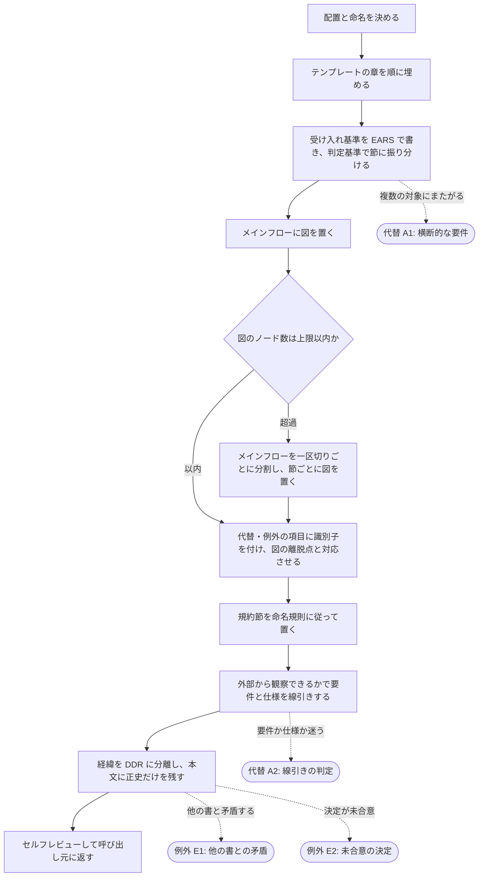

# 20-common-step-requirement スキル

## 概要

要件定義書の作成・更新の共通ステップの要件を定義する。書の置き場所と命名、章立て、受け入れ基準の書き方（EARS・フロー節の判定基準・メインフローの図示）、issue の受け入れ条件との対応、自由記述を許す箇所、要件と仕様の線引き、正史と経緯の分離を標準化する。置き場は AI アセット（`.claude/docs/`）とアプリ（アプリルートの `docs/`）の双方を扱う。設計・AI アセット設計の実施タスクから使われる。

- **背景**: 要件定義書は複数のタスク・複数のセッションで書かれるため、章立て・粒度・書き方が書き手ごとにぶれると、レビューの観点が定まらず、後から読む AI の解釈も揺れる。章の骨格は既に揃っている一方、受け入れ基準の中では、メイン・代替・例外の振り分けに判定基準が無く同じ性質の記述が別の節に入り、メインフローに規模の上限が無いため分岐と順序を追えない書が生まれ、4 番目以降の節が各書の任意の見出しに増殖している。また要件に内部構造（スクリプト名・判定順）や決定の経緯が混ざると、実装の変更や決定の変遷のたびに要件書が古くなる。
- **目的**: 誰が書いても同じ形・同じ抽象度の要件定義書になり、対象と 1:1 で辿れ、読めば「外から見て何が満たされるべきか」の現在の正だけが分かる状態を作る。受け入れ基準については、記述の置き場が判定基準で一意に決まり、メインフローの全体像が図で一目で追え、自由記述が許される箇所が限られている状態を作る。
- **スコープ**:
  - 含む: 配置と命名、frontmatter、章立てと各章の書き方、受け入れ基準の記法と節の順序、フロー節の判定基準、メインフローの図示と規模の上限、代替・例外フローへの離脱点の対応付け、規約節の命名と個数、自由記述を許す箇所と分量の目安、要件と仕様の線引きの判断、更新の仕方（正史の書き換え）、経緯の DDR への分離
  - 含まない: 要件の中身の合意（担い先: 呼び出し元のタスクと人間レビュー）、仕様書の書き方（担い先: `20-common-step-spec`）、DDR の起票そのものの手順（担い先: DDR の既存の書に倣う）、図の描画結果の検証（担い先: 人間のレビュアーが閲覧環境で確認する）、既存の要件定義書を新しい型へ揃える作業（担い先: 別 issue の棚卸し）

---

## ユーザーストーリー

**[As a]** 要件定義書をレビューする開発者として、

**[I want]** どの書も同じ章立て・同じ抽象度で書かれ、メインフローの全体像が図で一目で追え、ある記述がなぜその節にあるかが基準で説明でき、現在の正だけが書かれていてほしい。

**[So that]** レビューで見るべき場所が毎回同じになり、抜けの指摘が「読み切れた範囲」に依存しなくなるため。

---

## 受け入れ基準（Acceptance Criteria）

### メインフロー

- When 要件定義書を作るとき、Shall スキルは呼び出し元から渡された設計文書ルートの `00_requirement/` 配下に、対象と同名のファイルを置かなければならない（対象 1 つに要件定義書 1 つ）。設計文書ルートは、対象が AI アセット（スキル / フック / ルール / エージェント）なら `.claude/docs/`、対象がアプリなら[アプリルート](../../90_glossary/ドキュメント体系用語.md#アプリルート)の `docs/` である。
- When 置き場の中の並びを決めるとき、Shall AI アセットは対象種別のディレクトリ（`skills/` / `hooks/<イベント番号>/` / `rules/` / `agents/`）に置き、アプリは種別ディレクトリを持たず `00_requirement/<アプリ名>.md` に置かなければならない。
- If 呼び出し元が設計文書ルートを渡していない場合、Then スキルは推測せず、対象が AI アセットかアプリかを呼び出し元に確かめなければならない。
- When 書き始めるとき、Shall frontmatter（type / title / description / tags / keywords）を付け、章立てを 概要（背景・目的・スコープ）→ ユーザーストーリー → 受け入れ基準 → 前提条件 → 制約条件 → 依存関係 → 非機能要件 の順にしなければならない。
- When 受け入れ基準を書くとき、Shall EARS 記法（When 〜 Shall / If 〜 Then / Shall not）で書き、節を メインフロー → 代替フロー → 例外フロー → 規約節 → 他のスキル・機構との整合 の順に並べなければならない。
- When ある記述をどの節に置くか決めるとき、Shall スキルは「すべての実行が通る道か」「起点が正常か異常か」を上から順に問う判定基準に従い、書き手の感覚で振り分けてはならない。判定の結果は、代替フローの項目がすべて目的を達成して終わることで検算できなければならない。
- When メインフローを書くとき、Shall スキルは EARS の箇条書きに加えて、順序・分岐・代替と例外への離脱点を示す図を節の先頭に置かなければならない。図は EARS の要約であり、図にだけある情報を作ってはならない。
- When 図を置くとき、Shall 1 つの図のノード数は 15 以下でなければならない（代替・例外への離脱先を示す参照ノードは数えない）。
- If 1 つの図が 15 ノードを超える場合、Then スキルはメインフローを利用者から見た一区切り（承認・引き渡し・状態の確定が起きる点）で分割し、分割した節ごとに 1 つの図を置かなければならない。分割した節どうしは、前の節の図から次の節へ渡ることが図の上で辿れなければならない。上限以下であっても、一区切りが明確なら分割してよい。
- When 図に代替・例外への離脱点を書くとき、Shall 離脱先は代替フロー・例外フローの該当項目と識別子で対応し、図から節へ、節から図へ双方向に辿れなければならない。
- When 規約節を置くとき、Shall 見出しは規定の接頭辞で始まる命名規則に従い、書 1 つあたりの規約節は 3 つ以内でなければならない。規約節に置けるのはその書が定める成果物・データの中身の規定であり、順序や分岐（フロー）を置いてはならない。
- When 章を書くとき、Shall 自由記述（散文）で書いてよいのは 概要の導入・背景・目的 の 3 か所だけであり、それ以外の章は定型（箇条書き・表・EARS・図）で書かなければならない。自由記述の 3 か所には分量の目安が定められていなければならない。
- When 内容を書くとき、Shall 外部から観察できる振る舞い（何が起きるか・何が禁止されるか）だけを書き、内部構造（スクリプト名・コマンド・判定順・データのスキーマ・ファイルの実パス）は書かずに仕様書へ回さなければならない。
- When 決定に経緯（検討・却下した案・変遷）があるとき、Shall 本文には現在の正だけを書き、経緯は設計文書ルートの `20_ddr/` に分離しなければならない。
- When 既存の要件定義書を更新するとき、Shall 正史を直接書き換え、本文に変更履歴・追記の印を残してはならない（変遷は DDR と git 履歴が持つ）。

### 代替フロー

- **[A1]** If 複数の対象にまたがる横断的な要件がある場合、Then スキルはどれか 1 つの書に寄せるか対象を分割し、同じ内容を複数の書に重複して書いてはならない（他の書からは参照する）。
- **[A2]** If ある記述が要件か仕様か迷う場合、Then スキルは「外部の観察者（利用者・レビュアー）に見えるか」で判定し、見えないものは仕様に回さなければならない。
- **[A3]** If 対象が既に望む状態にある、または呼び出し元が複数の正しい入力形式のどれかを選んだ場合、Then その道は代替フローに置き、目的を達成して終わらなければならない。

### 例外フロー

- **[E1]** If 更新が他の要件定義書の記述と矛盾する場合、Then スキルは矛盾する書を特定して呼び出し元に返し、片方だけを直して不整合のまま残してはならない。
- **[E2]** If 決定がまだ人間と合意されていない場合、Then スキルは要件定義書に書かず、合意が先であることを呼び出し元に返さなければならない。
- **[E3]** If 前提が満たされていない、外部の操作が失敗した、機構に拒否された、または利用者が誤って使った場合、Then その道は例外フローに置かなければならない。目的を達成せずに返すことも、回復してメインフローに戻ることもある。
- **[E4]** If 判定基準を当てても節が一意に決まらない記述があった場合、Then スキルは自分で決めず、記述と当てはまらなかった理由を呼び出し元に返さなければならない。
- **[E5]** If 図の閲覧環境で図が描画されない場合、Then 要件定義書は読めなくなってはならない（図のソースは平文のまま順序と分岐が読み取れる書き方でなければならない）。

### 規約: メインフローの図

- When 図の記法を選ぶとき、Shall Markdown のコードブロックに埋め込める記法で書き、外部のファイル・画像・サービスに依存してはならない。
- When 図を書くとき、Shall 図のソースは 1 行に 2 つ以上の辺を連ねてはならない（1 行 1 辺）。行単位の差分で変更点が読める状態を保つ。
- When ノードに名前を付けるとき、Shall ラベルは利用者から見た動作または判定を表す日本語でなければならない（識別子だけのノードを置かない）。

### 規約: 自由記述の分量

- When 概要の導入・背景・目的を書くとき、Shall その 3 か所の合計が 600 字以内でなければならない（スコープは自由記述に数えず、項目数で縛る）。
- When 定型の章を書くとき、Shall スコープの「含む」「含まない」・前提条件・依存関係はそれぞれ 5 項目以内、非機能要件の表は 3〜6 行でなければならない。
- When 目安を超える必要が生じたとき、Shall スキルは目安を無視せず、対象の分割か仕様書への移動を呼び出し元に提案しなければならない。

### 他のスキル・機構との整合

- When 章立て・受け入れ基準の節構成を定めるとき、Shall 設計文書の成果物ルールと同じ内容を持ち、食い違わせてはならない。
- When 概要を書くとき、Shall 背景（なぜ要るか）・目的（どんな状態を作るか）・スコープ（含む / 含まない）を分けて書き、「含まない」にはどこが担うかを添えなければならない。
- When 要件定義書を新規作成または更新するとき、Shall 概要章に「issue の受け入れ条件との対応」の小節を置き、起点の issue の受け入れ条件を全件、それを満たす受け入れ基準の識別子または節名と対応づけた表で示さなければならない。
- If 起点の issue が無い場合、Then 小節に「起点の issue なし」と 1 行書き、表を省いてよい。
- When セルフレビューを行うとき、Shall 対応表の行数が起点の issue の受け入れ条件の数と一致することを確かめなければならない（issue → 要件の段の欠落を検出する）。
- Shall not 「関連するドキュメント」「レビュー記録」「変更履歴」の節を置かない（対応関係は命名規約が、レビューの経緯は MR が、変遷は DDR と git 履歴が持つ）。

---

## 前提条件

- 書く内容（要件そのもの）が呼び出し元のタスクで人間と合意済み、またはレビューで確定する前提で下書きされていること
- 要件定義書を読む環境が Markdown のコードブロックをそのまま表示できること（描画は必須ではない）

---

## 制約条件

- **技術的制約**: Markdown + frontmatter。1 ファイル 1 対象。図は Markdown に埋め込める記法に限り、外部ファイル・画像を持たない
- **ビジネス的制約**: 要件定義書は人間レビューの対象。読み手は人間と AI の両方
- **外部的制約**: 内部構造の正は仕様書、経緯の正は DDR。この書はそれらを重複して持たない。図が描画されるかは閲覧環境に依存し、この書は保証しない

---

## 依存関係

- `10-task-design-exec`・`10-task-ai-asset-design-exec`（呼び出し元）
- `20-common-step-spec`（内部構造の書き先）
- `ai-asset-design-docs` ルール（章立て・節構成の成果物ルール）
- DDR の既存の書（経緯の書き先・形式の手本）

---

## 非機能要件

| 項目 | 説明 |
|------|------|
| 一貫性 | どの要件定義書も同じ章立て・同じ記法・同じ抽象度で書かれる |
| 追跡性 | ファイル名から対象・仕様書・スキルが 1:1 で辿れる。図の離脱点から代替・例外の項目へ識別子で辿れる |
| 可読性 | メインフローの全体像が 1 つの図で追え、図が描画されない環境でもソースから順序と分岐が読み取れる |
| 判定可能性 | ある記述をどの節に置くかが判定基準で一意に決まり、決まらない場合は呼び出し元に返る |
| 保守性 | 実装の変更では要件書を直す必要がなく、要件の変更だけが差分になる |
