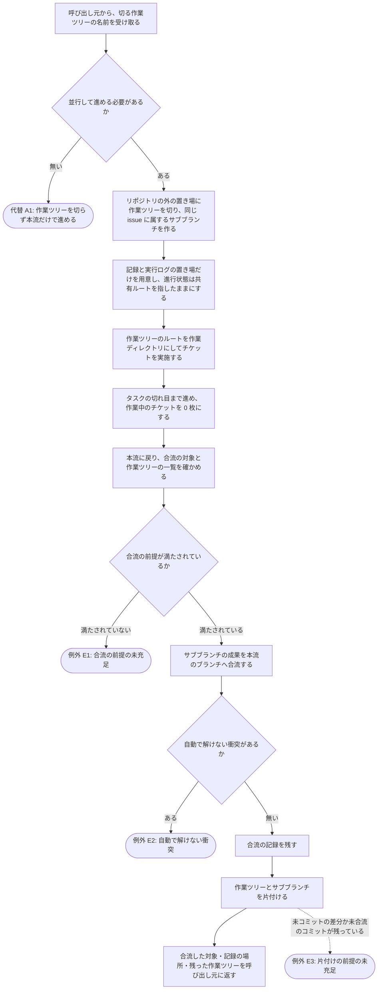

# 20-common-step-worktree スキル

## 概要

作業ツリー（`git worktree` で作る、同じリポジトリの 2 つ目以降のチェックアウト）の操作の common-step スキルの要件を定義する。作業ツリーを切る・一覧する・成果を本流へ合流する・片付ける、の 4 つを提供コマンド経由でだけ行えるようにし、その使い方を標準化する。

- **背景**: 機構は並行作業の手段として作業ツリーを認めているが、作成・合流・片付けの操作はどれも既定拒否の分類に落ちて AI からは実行できず、手順もどこにも書かれていない。そのため作業ツリーを使う運用は人間の手作業に頼るしかなく、合流の前提（作業中のチケットが残っていないか、同じ issue の成果か）も、合流したという事実も、どこにも残らない。
- **目的**: 作業ツリーの一生（切る → 使う → 合流する → 片付ける）が記録の残る 1 本の道に収まり、合流が前提を検査してから行われ、機械が判断してはいけない衝突では止まって人に返る状態を作る。
- **スコープ**:
  - 含む: 作業ツリーを切る（置き場・ブランチ名・記録の置き場の用意）、作業ツリーの一覧、本流への合流（前提検査・衝突の扱い・記録）、片付け（作業ツリーとブランチの削除）
  - 含まない: どのチケットをどの作業ツリーで実施するかの割り付けと、切るかどうかの判断（担い先: `00-workflow-issue-mr-driven`）／進行状態・ロック・集計の置き場の定義（担い先: `10_spec/フック共通仕様.md`）／チケットの採番（担い先: `20-common-step-ticket`）／push（担い先: `20-common-step-commit-push`）

### issue の受け入れ条件との対応

起点: issue #50（worktree 上での機構の健全性と、1 issue 内の同一フェーズのチケット並列実施）

| issue #50 の受け入れ条件 | 満たす受け入れ基準 |
|---|---|
| A1: worktree 上で機構（フック・提供コマンド・`boundary.sh`）が健全に動くことが実測で確かめられ、動かない箇所があれば直っている | メインフロー M4（記録と実行ログの置き場だけを用意し、進行状態は共有ルートを指したままにする）／規約: 作業ツリーの置き場とブランチ名 |
| A2: issue-MR 駆動を開始するときに worktree を切るかどうかの既定と手順が要件・仕様に定まっている | 代替フロー **[A1]**（既定は切らない）／メインフロー M1〜M5（切る手順）。切る / 切らないの判断そのものは `00-workflow-issue-mr-driven` が持つ |
| A3: 並行作業の手段（worktree / 別 clone）が CLAUDE.md か振り分けスキルから 1 ホップで辿れる | 他のスキル・機構との整合（`00-workflow-issue-mr-driven` からこの書を参照する）。参照を置く側は `00-workflow-issue-mr-driven` の要件が担う |
| A4: 1 issue の中で同じフェーズの依存しないチケットを並列に実施する方式について、採否と理由が新しい DDR に残っている | この書の対象外（DDR `i0050-01`・`i0050-03`・`i0050-05` が担う） |
| A5: 並列を採用する場合、宣言範囲の強制・差分の基準点・実行者照合が worktree ごとに一意に決まることが仕様に明記され、機械テストで確認されている | この書の対象外（`workflow-guard` / `workflow-diff-check` / `subagent-start-check` の要件と仕様が担う）。この書は前提条件として 1 作業ツリー = 作業中チケット 1 枚を保つ側に立つ |
| A6: 並列を採用する場合、並列作業の成果を feature ブランチへ合流させる手順（チケットファイルの衝突の扱いを含む）が定まっている | メインフロー M6〜M13／代替フロー **[A3]**・**[A4]**／例外フロー **[E1]**・**[E2]**／規約: 合流の記録 |

---

## ユーザーストーリー

**[As a]** 1 つの issue の中で複数のチケットを同時に進めたい開発者として、

**[I want]** 作業ツリーを切ることと、その成果を feature ブランチへ戻すことが、決まった手順と記録付きで行われてほしい。

**[So that]** 並行して進めた成果が取りこぼされず、合流の失敗と、機械が判断してはいけない衝突が、黙って通ることなく手元に返るため。

---

## 受け入れ基準（Acceptance Criteria）

### メインフロー

- **When** 作業ツリーを切るとき、**Shall** スキルは提供コマンド経由で切り、`git` の作業ツリーの作成・削除・移動のコマンドを直接実行してはならない（機構が拒否する）。
- **When** 作業ツリーを切るとき、**Shall** 置き場はリポジトリの外に取られ、そこで使うブランチは本流のブランチから機械的に導かれる名前で新しく作られなければならない（本流と同じブランチを 2 か所で開かない）。
- **When** 作業ツリーを切るとき、**Shall** その作業ツリーには記録と実行ログの置き場だけが用意され、進行状態・承認の記憶・ロック・集計は複製されず共有ルートのものが参照され続けなければならない。
- **When** 作業ツリーの中でチケットを実施するとき、**Shall** その作業ツリーの作業中のチケットは 1 枚を超えてはならず、実施は作業ツリーのルートを作業ディレクトリとして行われなければならない。
- **When** 作業ツリーの成果を本流へ戻すとき、**Shall** スキルはタスクの切れ目（合流に関わるどの作業ツリーも作業中のチケットが 0 枚）で、本流から、提供コマンド経由で合流しなければならない。
- **When** 合流を行う前に、**Shall** 提供コマンドは前提（本流で実行されていること・合流に関わるどの作業ツリーにも作業中のチケットが無いこと・どちらにも未コミットの変更が無いこと・対象が同じ issue に属するブランチであること）を全件検査し、1 つでも満たされないときは合流を行ってはならない。
- **When** 合流が成功したとき、**Shall** いつ・どの作業ツリーの・どのブランチの成果を・どのコミットとして合流したかが共有ルートの記録に残らなければならない。
- **When** 合流が済んだ作業ツリーを片付けるとき、**Shall** スキルは提供コマンド経由で作業ツリーとサブブランチを削除し、削除した対象を呼び出し元に報告しなければならない。

### 代替フロー

- **[A1]** **If** 並行して進める必要が無い場合、**Then** スキルは作業ツリーを切らず本流だけで進めなければならない（これが既定である）。切るかどうかの判断は呼び出し元（`00-workflow-issue-mr-driven`）が行い、このスキルは求められたときにだけ切る。
- **[A2]** **If** 作業ツリーの状況だけを知りたい場合、**Then** スキルは提供コマンドの一覧で、本流を含むすべての作業ツリーについて、置き場・ブランチ・このスキルの管理対象か・作業中のチケット・未コミットの変更の有無を得なければならない。一覧は本流でも作業ツリーの中でも得られる。
- **[A3]** **If** **並列実施を行う場合**で、合流の対象となる作業ツリーが複数ある場合、**Then** スキルは 1 つずつ順に合流し、途中で失敗したらそこで止めて、合流できた対象と残っている対象を分けて報告しなければならない（失敗した対象を飛ばして続けない）。
- **[A4]** **If** 対象の成果が既に本流に取り込まれている場合、**Then** スキルは合流を行わず「取り込み済み」として成功で返さなければならない（同じ合流を二度求められても結果が変わらない）。
- **[A5]** **If** 置き場を既定と別の場所にしたい場合、**Then** スキルは置き場を明示して切ることができる。明示された置き場もリポジトリの外でなければならない。
- **[A6]** **If** 利用者が応答できない実行形態（ヘッドレス）の場合、**Then** 切る・一覧する・片付けるは承認を求めずに進めなければならない（既定の置き場に切り、片付けは前提を満たすときだけ行う）。合流も承認を求めずに進めるが、例外フロー **[E2]** に当たったときはそこで止まる。

### 例外フロー

- **[E1]** **If** 合流の前提のいずれかが満たされない場合、**Then** スキルは合流を行わず、満たされなかった前提を全件伝えて失敗として終わらなければならない（1 件目で止めない）。前提を満たしてから再実行する。
- **[E2]** **If** 合流で自動的に解けない衝突が出た場合、**Then** スキルは合流を中断して合流前の状態に戻し、衝突したファイルの一覧を伝えて失敗として終わらなければならない。**Shall not** 衝突の中身を判断してどちらか一方に寄せて先へ進んではならない（成果物の内容の判断を機械にさせない）。呼び出し元は解消を試みず、人に返す。
- **[E3]** **If** 片付けの対象に未コミットの差分、または本流へ合流していないコミットが残っている場合、**Then** スキルは削除せず、残っているものを伝えて失敗として終わらなければならない。
- **[E4]** **If** 同じ名前の作業ツリーかブランチが既にある場合、または置き場が既に使われている場合、**Then** スキルは作らず、既にある対象を伝えて失敗として終わらなければならない（既存を上書きしない）。
- **[E5]** **If** 本流でないチェックアウト（作業ツリーの中）で、切る・合流する・片付けるを求められた場合、**Then** スキルは実行せず、本流で行うよう案内して失敗として終わらなければならない。
- **[E6]** **If** このスキルが作ったものでない作業ツリー（外部の仕組みが作ったもの）が合流・片付けの対象に指定された場合、**Then** スキルは対象にせず、管理対象でないことを伝えて失敗として終わらなければならない。一覧では管理対象かどうかを区別して示す。
- **[E7]** **If** 作業ツリーやブランチの操作そのものが失敗した場合、**Then** スキルは失敗の内容をそのまま伝えて終わらなければならない。**Shall not** 安全装置を外す指定で押し通してはならない。

### 規約: 作業ツリーの置き場とブランチ名

- **When** 置き場を決めるとき、**Shall** 既定はリポジトリの外に取られなければならない（リポジトリの配下、とりわけ機構の保護対象の配下には作らない）。
- **When** ブランチ名を決めるとき、**Shall** 本流のブランチ名から機械的に導かれ、名前だけで「同じ issue に属する作業ツリーのブランチである」ことが判別できる形でなければならない。
- **When** 作業ツリーで作業するとき、**Shall not** そのサブブランチをリモートへ push してはならない（MR を増やさないため。push は本流だけで行う — `20-common-step-commit-push`）。

### 規約: 合流の記録

- **When** 合流を試みたとき、**Shall** 成功・中断のどちらでも 1 回につき 1 件の記録が共有ルートに追記され、時刻・対象の作業ツリーとブランチ・結果・合流したコミット（成功時）・衝突したファイル（中断時）が分かる形でなければならない。
- **When** 記録を残すとき、**Shall** 記録は合流の後に作業ツリーを片付けても残らなければならない（片付けで消える置き場に置かない）。

### 他のスキル・機構との整合

- **When** どのチケットをどの作業ツリーで実施するかを決めるとき、**Shall** 割り付けは `00-workflow-issue-mr-driven` が行い、このスキルは切る・一覧する・合流する・片付けるだけを担わなければならない。
- **When** 作業ツリーの中でチケットを新規に作りたくなったとき、**Shall** スキルは本流で作らなければならない（採番の正は `20-common-step-ticket`）。
- **When** 進行状態・ロック・集計の置き場を扱うとき、**Shall** このスキルは置き場を定義せず、`10_spec/フック共通仕様.md` の定めに従わなければならない。
- **When** 他のスキルが作業ツリーの操作を説明するとき、**Shall not** 手順を再掲せず、このスキルを参照しなければならない。

---

## 前提条件

- 1 つの issue に 1 つのブランチと 1 つの MR が対応しており、本流はその feature ブランチをチェックアウトしていること
- 進行状態・承認の記憶・ロック・集計が共有ルートに一本化されていること（作業ツリー側に複製しないで済む前提）
- 作業ツリーの操作を提供コマンドとして識別し、その置き場を指す引数を書き込みの判定から外す機構が入っていること
- git の作業ツリー機能が使える環境であること（同じブランチを 2 つの作業ツリーで開けないという制約を含む）

---

## 制約条件

- **技術的制約**: 作業ツリーの作成・削除・移動と、ブランチ間の合流は、提供コマンド経由でしか行えない（直接のコマンドはどの分類にも当たらず拒否される）
- **ビジネス的制約**: 合流で残った衝突の解消は成果物の内容の判断であり、人が行う。機械は中断までを担う
- **外部的制約**: 作業ツリーの解決・パスの畳み込み・進行状態の置き場は機構（フック）の仕様が正で、このスキルはそれに従う

---

## 依存関係

- `20-common-step-ticket`（作業中のチケットの枚数の判定と、採番の本流一本化）
- `20-common-step-commit-push`（本流だけで push する規約と、コミット済みであることの検査）
- `00-workflow-issue-mr-driven`（呼び出し元。切る判断・チケットの割り付け・切れ目での合流の起動）
- `10_spec/フック共通仕様.md`（作業ツリーの三分・進行状態の置き場・提供コマンドの識別・コマンドの分類）
- git（作業ツリーとブランチの操作。バージョンによる差は提供コマンドが吸収する）

---

## 非機能要件

| 項目 | 説明 |
|------|------|
| 追跡性 | 合流したことと、合流できなかったことが、作業ツリーを片付けた後も記録から辿れる |
| 安全性 | 前提を満たさない合流と、内容の判断を要する衝突は、進まずに止まる。安全装置を外す指定を既定で使わない |
| 冪等性 | 同じ合流・同じ片付けを二度求めても状態が壊れず、二度目は「済んでいる」として返る |
| 一貫性 | 作業ツリーが 1 つでも複数でも、置き場・ブランチ名・記録の形が同じになる |
| 応答性 | 一覧と前提検査は、作業ツリーの数に比例する程度の手数で終わる（リモートに問い合わせない） |
