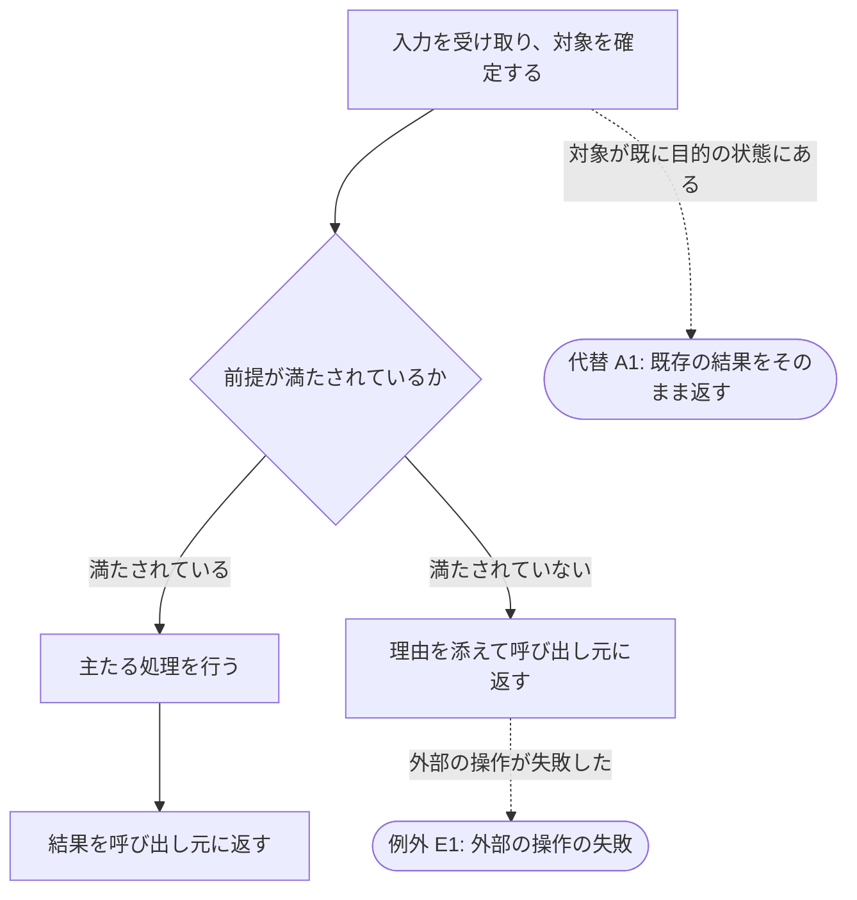

# {{TITLE}}

## 概要

<!-- 何の要件かを 1〜3 行で。続けて 背景（なぜ要るか）/ 目的（何を達成するか）を書く。自由記述はこの導入・背景・目的の 3 か所だけで、合計 600 字以内。スコープは定型（含む・含まないの箇条書き。含まないには担い先を添える） -->

{{OVERVIEW}}

- **背景**: {{BACKGROUND}}
- **目的**: {{GOAL}}
- **スコープ**:
  - 含む: {{IN_SCOPE}}
  - 含まない: {{OUT_OF_SCOPE}}（担い先: {{OUT_OF_SCOPE_OWNER}}）

---

## ユーザーストーリー

<!-- 誰が（役割）・何を望み・なぜか。外部の観察者の視点で書く -->

**[As a]** {{AS_A}}として、

**[I want]** {{I_WANT}}、

**[So that]** {{SO_THAT}}ため。

---

## 受け入れ基準（Acceptance Criteria）

<!--
  節はこの順に置く: メインフロー → 代替フロー → 例外フロー → 規約節（0〜3）→ 他のスキル・機構との整合（0〜1）。
  どの節に置くかは上から順に判定する（最初に当たった節に置く。決まらなければ呼び出し元に返す）:
    1. 目的を達成するすべての実行が通る道 → メインフロー
    2. 起点が正常（呼び出し元の入力・選択の違い / 対象が既に目的の状態にある / 複数の正しい入力形式）→ 代替フロー
    3. 起点が異常（前提の不充足 / 外部の失敗 / 機構の拒否 / 利用者の誤用 / 壊れた状態）→ 例外フロー
    4. フローではなく成果物・データの中身の規定 → 規約節
    5. 他のアセットとの関係の規定 → 他のスキル・機構との整合
  検算: 代替フローの項目はすべて目的を達成して終わる。達成せず返す項目があれば起点の判定を誤っている。
  EARS（When 〜 Shall / If 〜 Then / Shall not）で書く。内部構造（スクリプト名・判定順・スキーマ）は書かず仕様書へ。
-->

### メインフロー

<!--
  EARS 箇条書きの前に mermaid の図を 1 つ置く。図は箇条書きの要約で、図にだけある情報を作らない。
  ノード ID は M1, M2, … の通し番号（分割しても文書全体で継続）。判定は {…}、通常は […]。
  1 行に 2 つ以上の辺を連ねない。ラベルは日本語の動作・判定（識別子だけのノードを置かない）。
  M ノードが 15 を超えたら「### メインフロー: <一区切りの名前>」で節を分け、節ごとに 1 図を置く
  （一区切り = 承認・引き渡し・状態の確定が起きる点。15 以下でも一区切りが明確なら分けてよい）。
  分けた節は前の節の図の末尾に N1([次: メインフロー: <次の節名>]) を置いて実線で繋ぐ。
  離脱先の参照ノード（A1 / E1 / N1）はノード数に数えない。
-->

以下は記入例。ノードのラベルと辺を対象の振る舞いに差し替えて使う（ID の付け方・線種・形はそのまま）。

- **When** {{MAIN_WHEN}}、**Shall** {{MAIN_SHALL}}

### 代替フロー

<!-- 各項目の先頭に識別子 **[A1]** を置き、図の参照ノードの ID と一致させる。図に離脱点が無い項目にも識別子を付ける -->

- **[A1]** **If** {{ALT_IF}}、**Then** {{ALT_THEN}}

### 例外フロー

<!-- 各項目の先頭に識別子 **[E1]** を置き、図の参照ノードの ID と一致させる -->

- **[E1]** **If** {{EXC_IF}}、**Then** {{EXC_THEN}}
- **[E2]** **When** {{EXC_WHEN}}、**Shall not** {{EXC_SHALL_NOT}}

### 規約: {{CONVENTION_SUBJECT}}

<!-- 見出しは「規約: <対象>」で始める。1 書に 3 節まで。置けるのは成果物・データの中身の規定で、順序・分岐（フロー）は置かない。無ければ節ごと削除する -->

- **When** {{CONVENTION_WHEN}}、**Shall** {{CONVENTION_SHALL}}

### 他のスキル・機構との整合

<!-- 他のアセットとの関係の規定。1 書に 1 節まで。受け入れ基準の最後に置く。無ければ節ごと削除する -->

- **Shall** {{CONSISTENCY_SHALL}}

---

## 前提条件

<!-- この要件が成り立つために、外側で満たされているべきこと。5 項目以内 -->

- {{PRECONDITION}}

---

## 制約条件

<!-- 技術的 / ビジネス的 / 外部的な制約。守るべき境界を書き、実現手段は書かない -->

- **技術的制約**: {{TECHNICAL_CONSTRAINT}}
- **ビジネス的制約**: {{BUSINESS_CONSTRAINT}}
- **外部的制約**: {{EXTERNAL_CONSTRAINT}}

---

## 依存関係

<!-- 呼び出し元・呼び出し先・前提となるアセットや外部ツール。5 項目以内 -->

- {{DEPENDENCY}}

---

## 非機能要件

<!-- 再現性・追跡性・一貫性・安全性など、観察できる品質の要件を表で。3〜6 行 -->

| 項目 | 説明 |
|------|------|
| {{NFR_ITEM}} | {{NFR_DESCRIPTION}} |
